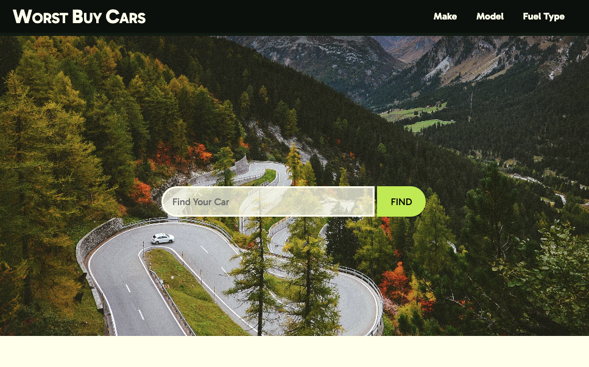
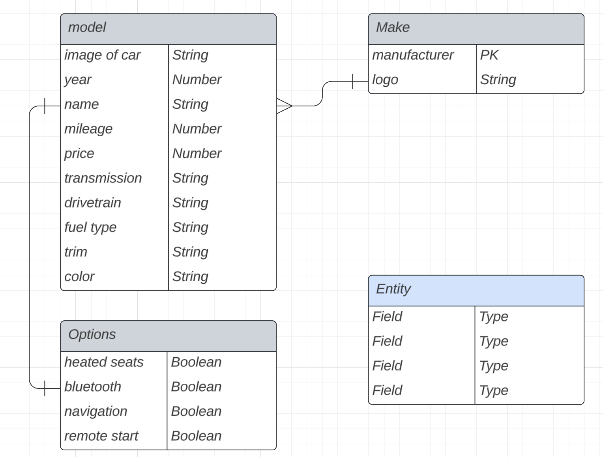
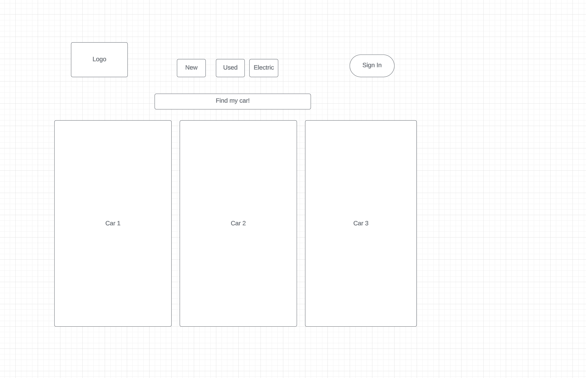

# WorstBuy

Worst Buy Cars is a mock e-commerce site that forces the user to default to a premium purchase car.

The user can find a car using the buttons on the navigation menu or using the search bar within the header. From there, the user can change the options package on each car, updating the car in the database. Each car is displayed with lots of information including package details, price and a picture of the car option.

## During this project, we completed the following: 
1. Created a MongoDB using mongoose
2. Created controllers for finding and using the data
3. Developed a front end webpage
4. Created functionality on the front end page using JS

## Our Group Process: 

Given our group theme of automobiles, we discussed how our database would be organized and created a database structure idea.

After structuring our database, we created a wireframe for our site.

From there, we divided up tasks to play to each group members strengths.

## Resources:
- ChatGPT for quickly producing information to seed the database
- Prior labs for MongoDB and Mongoose
